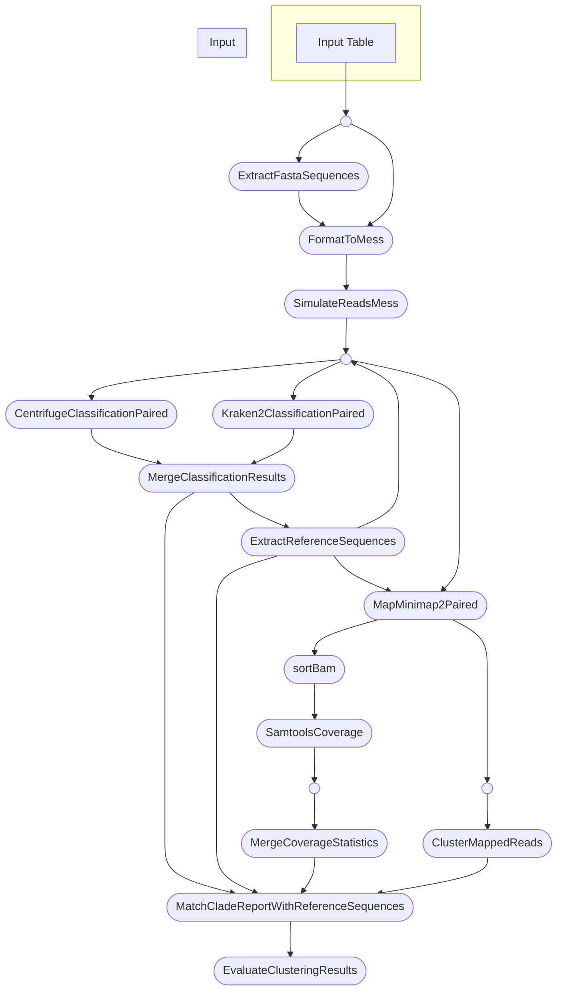

## Benchmarking Cluster Evaluation of Metagenomic Results

Metagenomic analysis creates a wealth of data that can be challenging to interpret. One of the main challenges in this field is to discriminate between Cross-Hits - Metagenomic classifiers often return multiple, related, hits. This makes it difficult to determine which hit is the most relevant for a given sample. This project aims to benchmark effectiveness of clustering in resolving these Cross-Hits.

## Project Structure

The project is structured to facilitate the evaluation of clustering methods on metagenomic data. The main components include:

- **simulation**: Simulating reads from reference assemblies to create a controlled dataset for testing.
- **classification/**: Classifying metagenomic reads using Centrifuge and Kraken2 classifiers.
- **mappings**: Mapping classified reads to reference assemblies to evaluate the accuracy of classifications.
- **clustering/**: Clustering classified reads and evaluating the clusters.
- **deployment/**: Contains deployment scripts and parameters for running the project in different environments.
- **reference_management/**: Contains scripts for managing reference assemblies and their taxonomic classifications.

## Requirements

- Nextflow

- A conda environment with the the following packages:
  - `biopython`
  - `mess`

This environment must be activated before running the nextflow workflow.

- a python environment with the following packages:

  - `pandas`
  - `numpy`
  - `Biopython`

- Metagenomic classifiers:
  - Centrifuge
  - Kraken2
    and their respective databases.

# Running the Project

Begin by setting up the parameters for the project in the `deployment/params.json` file. This file contains paths to the necessary scripts and binaries, as well as parameters for the classifiers and clustering methods.

activate the conda environment and run the Nextflow workflow:

```bash
nextflow run main.nf -profile conda --params_file deployment/params.json
```

This will execute the workflow, simulating reads, classifying them, mapping them to references, clustering the results, and evaluating the clusters.

# Nextflow workflow


