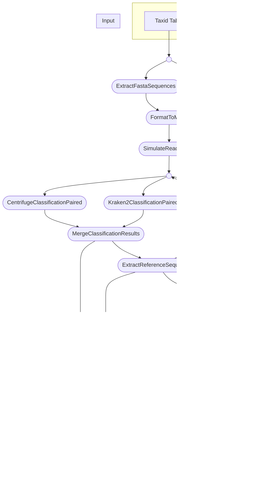

## Benchmarking Cluster Evaluation of Metagenomic Results

# Running the Project

Begin by setting up the parameters for the project in the `deployment/params.json` file. This file contains paths to the necessary scripts and binaries, as well as parameters for the classifiers and clustering methods.

activate the conda environment and run the Nextflow workflow:

```bash
nextflow run main.nf -profile conda --params_file deployment/params.json
```

This will execute the workflow, mapping them to references, clustering the results, and evaluating the clusters.

# Nextflow workflow


